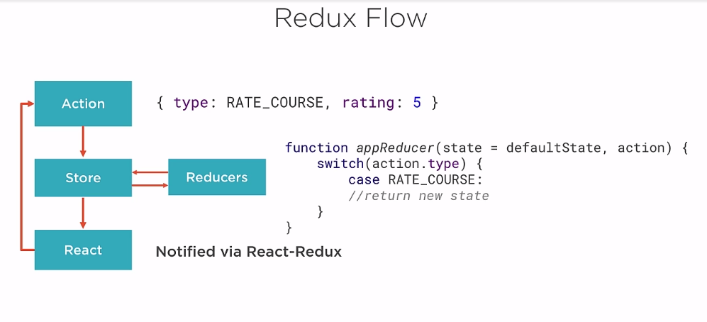

>Redux flow

+ 1/Action: describe user intend

+ 2/Action will be handle by reducer. Reducer is the function take in a state & action 
and return new state

+ 3/New state return from reducer the store will be update

+ 4/React will be re-render and connect to store using react redux

